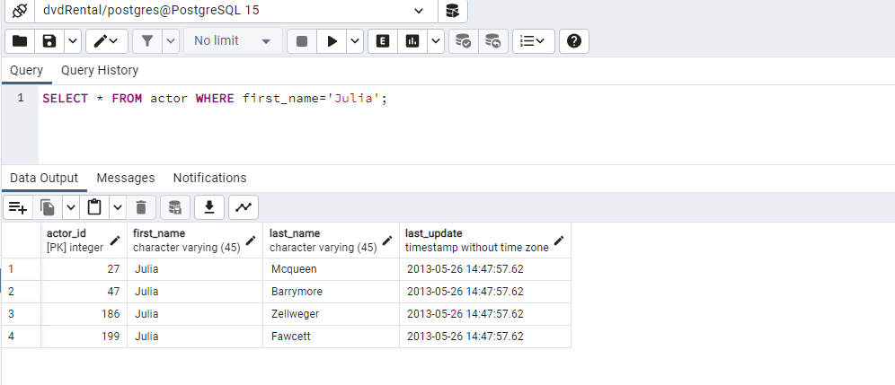
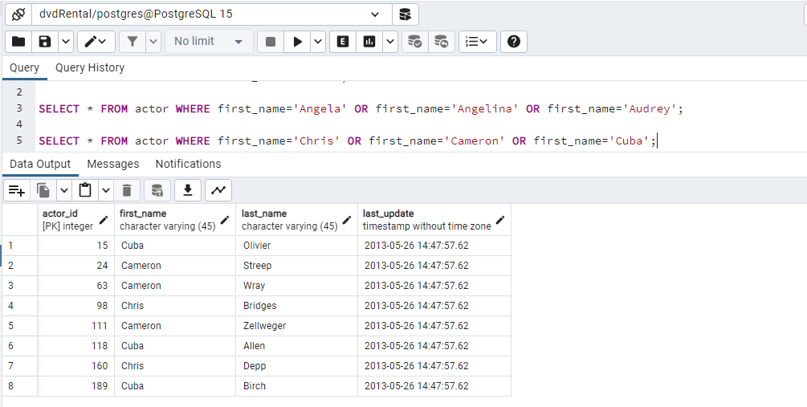
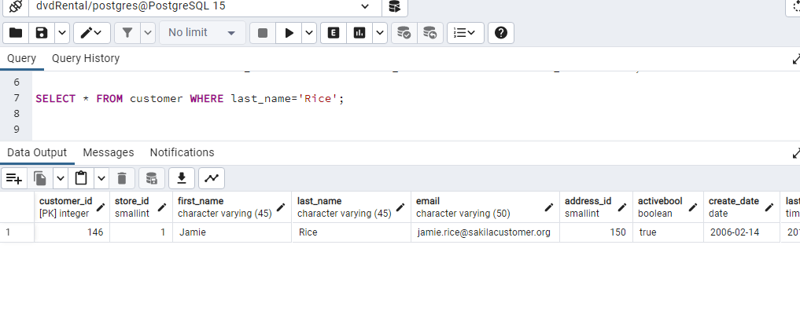
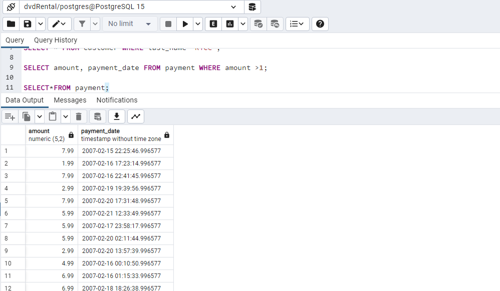
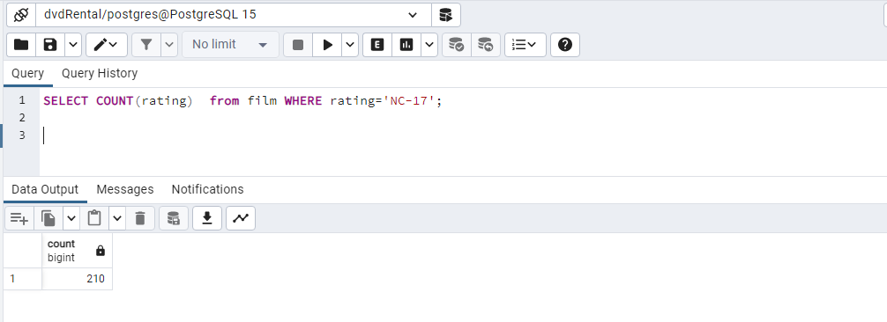
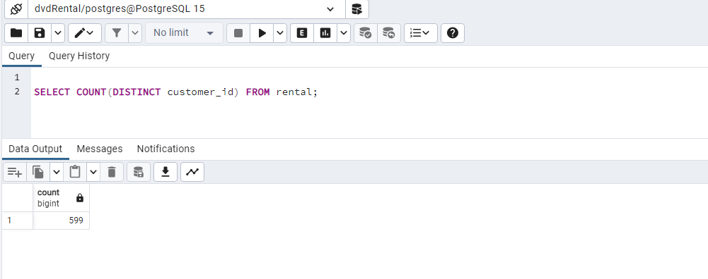

#Ejercicio de consulta SQL con la base de datos 'dvdRental' Querys

1.  Selecciona las columnas film_id y title de la tabla film.

            SELECT campo1, campo2 FROM nombre_tabla

`SELECT film_id, title FROM film;`

2.  Selecciona 5 filas de la tabla film, obteniendo todas las columnas.

            SELECT * FROM nombre_tabla LIMIT n;

`SELECT * FROM film LIMIT 5;`

3.  Selecciona filas de la tabla film donde film_id sea menor que 4.

            SELECT campos FROM tabla WHERE condicion

`SELECT * FROM film WHERE film_id>4;`

4.  Selecciona filas de la tabla film donde el rating sea PG o G.

            SELECT campos FROM tabla WHERE condición OR condición...

5.  Selecciona filas de la tabla actor donde el nombre sea Angela, Angelina o Audrey usando IN.

            SELECT * FROM customer WHERE first_name!='John' AND first_name!='Barbara';

`SELECT * FROM actor WHERE first_name='Angela' OR first_name='Angelina' OR first_name='Audrey';`

6.  Obtén una lista de actores con el nombre Julia.

            SELECT name from actor where last_name='Julia'

`SELECT * FROM actor WHERE first_name='Julia';`

7. Obtén una lista de actores con los nombres Chris, Cameron o Cuba.

`SELECT * FROM actor WHERE first_name='Chris' OR first_name='Cameron' OR first_name='Cuba';`  

8. Selecciona la fila de la tabla customer para el cliente con el nombre Jamie Rice.

`SELECT * FROM customer WHERE first_name='Jamie Rice';`

9. Selecciona el monto y la fecha de pago de la tabla payment donde el monto pagado sea menor a $1.

`SELECT amount, payment_date FROM payment WHERE amount >1;`

10. ¿Cuáles son las diferentes duraciones de alquiler permitidas por la tienda?

`SELECT DISTINCT rental_duration FROM film ORDER BY rental_duration;`

11. Ordena las filas en la tabla city por country_id y luego por city.

            ORDER BY columna ASC|DESC,columna ASC|DESC,...

`SELECT*FROM city ORDER BY country_id, city;`

12. ¿Cuáles son los ID de los últimos 3 clientes que devolvieron un alquiler?

`SELECT*FROM rental WHERE return_date IS NOT NULL ORDER BY return_date DESC LIMIT 3;`

13. ¿Cuántas películas tienen clasificación NC-17? ¿Cuántas tienen clasificación PG o PG-13?

`SELECT COUNT(rating)  FROM film WHERE rating='NC-17';`
`SELECT COUNT(rating)  FROM film WHERE rating='PG' OR rating='PG-13';`

`SELECT rating, COUNT(rating) FROM film`
`WHERE rating='PG' OR`
`rating = 'PG-13'`
`rating ='NC-17'`
`GROUP BY rating; `

14. ¿Cuántos clientes diferentes tienen registros en la tabla rental?

`SELECT COUNT(DISTINCT customer_id) FROM rental;`

15. ¿Hay algún cliente con el mismo apellido?

16. ¿Qué película (id) tiene la mayor cantidad de actores?

17. ¿Qué actor (id) aparece en la mayor cantidad de películas?

18. Cuenta el número de ciudades para cada country_id en la tabla city. Ordena los resultados por count(\*).

19. ¿Cuál es la tarifa de alquiler promedio de las películas? ¿Puedes redondear el resultado a 2 decimales?

20. Selecciona los 10 actores que tienen los nombres más largos (nombre y apellido combinados).

